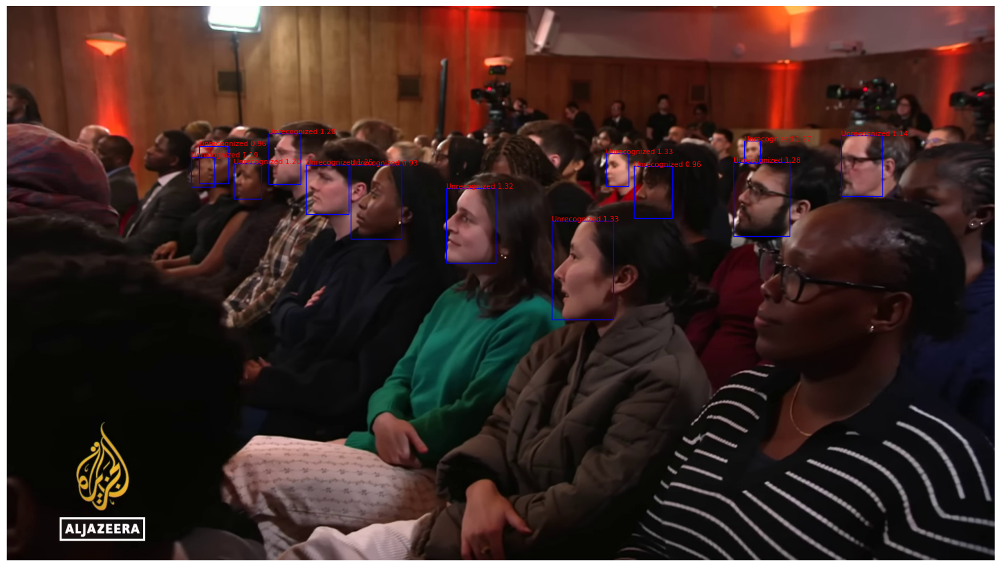

# Face Detection and Recognition Portfolio Project

## 🌟 Introduction

Welcome to my **Face Detection and Recognition** project—a flagship piece in my AI portfolio! This project demonstrates how cutting-edge deep learning and computer vision can be applied to real-world video data, transforming raw YouTube footage into actionable insights. From downloading interviews to identifying individuals frame-by-frame, this project is a testament to the power of open-source AI and my ability to build robust, end-to-end solutions.

---

## 🖥️ Interactive Flask Web App

This project features a powerful and user-friendly Flask web application that brings face detection and recognition to your browser:

- **Paste or batch-upload YouTube video URLs**: Analyze one or many videos at once.
- **Upload known faces via the web**: Add new people to your recognition database with just a few clicks.
- **Detailed result pages**: For each video, view the main detection image, all detected faces, recognized names, and confidence scores.
- **Downloadable results**: Download the main result image, cropped face images, and a summary CSV report for each video.
- **Progress indicator**: See a spinner while your videos are being processed, for a smooth user experience.
- **Modern, clean interface**: Built for clarity and ease of use, making advanced AI accessible to everyone.

To try it out, simply run the app and open your browser to the provided address. No coding required!

---

## 🛠️ Technologies & Tools

- **Python**: The backbone of the project, enabling seamless integration of all components.
- **facenet-pytorch**: For state-of-the-art face detection (MTCNN) and face recognition (InceptionResnetV1).
- **PyTorch & torchvision**: Deep learning frameworks for model building and image processing.
- **OpenCV (cv2)**: For video processing, frame extraction, and image manipulation.
- **PIL (Pillow)**: For flexible image loading and handling.
- **matplotlib**: For clear, insightful visualizations.
- **pytubefix & yt-dlp**: For robust, flexible YouTube video downloading.
- **ffmpeg**: For precise video editing and truncation.

---

## 🎬 Real-World Workflow

### 1. **Video Download & Preparation**
- Downloaded a real interview from YouTube using `pytubefix` and `yt-dlp`.
- Used `ffmpeg` to trim the video, focusing on the most relevant segment for analysis.

### 2. **Frame Extraction**
- Leveraged OpenCV to extract frames at regular intervals, creating a rich dataset for face analysis.
- Inspected and visualized frames to ensure data quality and diversity.

### 3. **Face Detection & Landmark Extraction**
- Applied the MTCNN model from `facenet-pytorch` to detect faces and extract key facial landmarks (eyes, nose, mouth) in each frame.
- Visualized bounding boxes and landmarks for transparency and interpretability.

### 4. **Dataset Curation**
- Manually selected frames of two known individuals (Kimani and Mehdi) and organized them into labeled directories.
- Created a PyTorch `ImageFolder` dataset for efficient data loading and management.

### 5. **Face Embedding Generation**
- Used the InceptionResnetV1 model (pre-trained on VGGFace2) to generate 512-dimensional embeddings for each detected face.
- Averaged embeddings per individual to create a compact, robust face database.

### 6. **Face Recognition & Evaluation**
- For new frames, detected faces and generated embeddings.
- Compared embeddings to the database using Euclidean distance, recognizing known individuals or flagging as "Unrecognized".
- Visualized recognition results with bounding boxes and labels for clarity.

---

## ✨ What Makes This Project Stand Out?

- **End-to-End Real-World Pipeline**: From raw YouTube video to live face recognition.
- **Integration of Multiple Tools**: Combines video downloading, editing, deep learning, and visualization in one seamless workflow.
- **State-of-the-Art Models**: Utilizes MTCNN and InceptionResnetV1 for robust detection and recognition.
- **Hands-On Deep Learning**: Experience with PyTorch, data loaders, and embedding-based recognition.
- **Transparent & Visual**: Every step is visualized for interpretability and portfolio impact.
- **Practical Application**: Demonstrates how AI can be used for media analysis, security, and more.

---

## 📦 How to Run This Project

1. **Clone the Repository**
   ```bash
   git clone <your-repo-url>
   cd Face_recognition
   ```
2. **Install Dependencies**
   ```bash
   pip install -r requirements.txt
   ```
3. **Run the Notebook**
   - Open `Copy_of_Face_detection_and_recognition.ipynb` in Jupyter Notebook or JupyterLab.
   - Follow the step-by-step instructions and code cells.

---

## 📸 Sample Results



*Example: Detected faces with bounding boxes, names, and confidence scores as shown in the Flask app.*

---

## 🤝 Acknowledgements

- Inspired by open-source projects and the vibrant computer vision community.
- Special thanks to the developers of `facenet-pytorch`, `pytubefix`, `yt-dlp`, and `OpenCV`.

---

## 📬 Contact

For questions, collaborations, or feedback, feel free to reach out via [your email] or connect on [LinkedIn/GitHub].

---

## 🚀 Why This Project?

This project is more than just code—it's a demonstration of my ability to:
- Tackle real-world data challenges
- Integrate multiple advanced tools
- Build interpretable, impactful AI solutions
- Communicate results clearly and visually

**If you're looking for someone who can turn raw data into real insights, let's connect!**

---

## ⚡ Flask App Setup & Usage

1. **Clone the Repository**
   ```bash
   git clone <your-repo-url>
   cd Face_recognition
   ```
2. **Install Dependencies**
   ```bash
   pip install -r requirements.txt
   ```
3. **Prepare Known Faces Directory**
   - Create a folder named `known_faces` in the project root (if it doesn't exist).
   - Optionally, add subfolders named after each person (e.g., `kimani`, `mehdi`), each containing a few `.jpg` images of that person. You can also upload known faces via the web app interface.
4. **Run the Flask App**
   ```bash
   python app.py
   ```
5. **Access the App in Your Browser**
   - Open your browser and go to: [http://127.0.0.1:5000/](http://127.0.0.1:5000/)
6. **Usage**
   - Paste one or more YouTube video URLs (one per line) and click Analyze.
   - Upload new known faces via the "Upload Known Face" link.
   - Click "View Details" on any result to see all detected faces, names, confidences, and download options. 